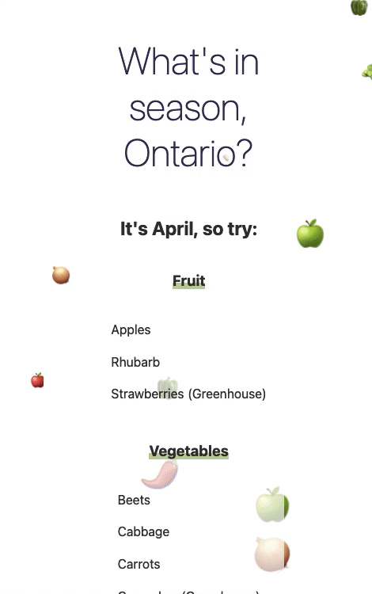

# Produce in Season

[Link to Demo](https://andreidobrinski.com/produce-in-season/)

An app to show what produce is in season this month in Ontario.

- See produce in season this month
- Show/hide based on fruit/vegetable headers
- Check items off the list
- See emoji confetti from the in-season produce

Data from [Ontario.ca](https://www.ontario.ca/foodland/page/availability-guide)

## Running Locally

1. Install dependencies

```bash
cd produce-in-season
npm install
```

2. Start development server

```bash
npm run dev
```

3. Open [localhost:5000](http://localhost:5000) in the browser

## Technologies Used

- [Svelte](https://svelte.dev/)
- [Rollup](https://rollupjs.org)
- Confetti animation from [Svelte tutorial](https://svelte.dev/tutorial/congratulations)
- Data from [Ontario.ca](https://www.ontario.ca/foodland/page/availability-guide)
